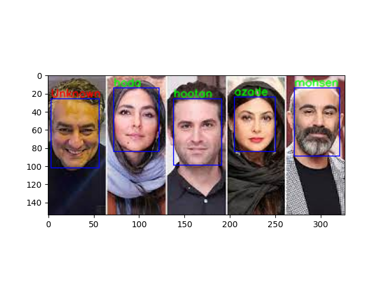
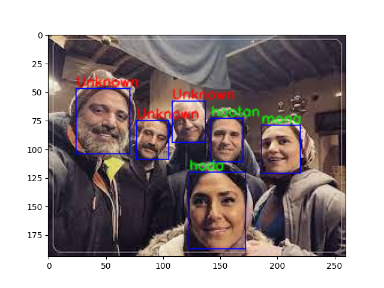

# Deeplearning10
The 10assignement of DeepLearning course- Face verification

------------------------


## Face verification using [insightface library](https://github.com/deepinsight/insightface/tree/master/python-package)

## How to install:

```
pip install -r requirements.txt
```
## How to run:

### For face verification:

```
python face_verification.py --image1 "Path of the first image" --image2 "Path of the second image"
```
### For face identification:
```
python face_identification.py --image "Path of an image to identification"
```
#### Examples of outputs:




### In order to updating the face bank:
```
python face_identification.py --update
```